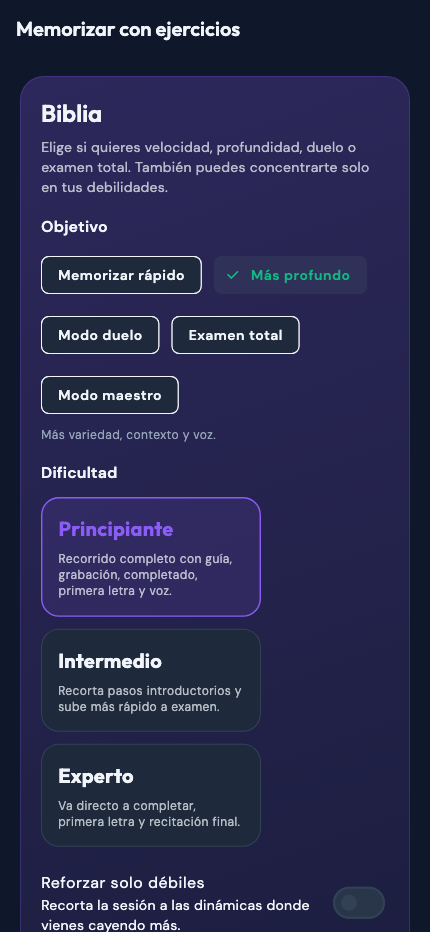
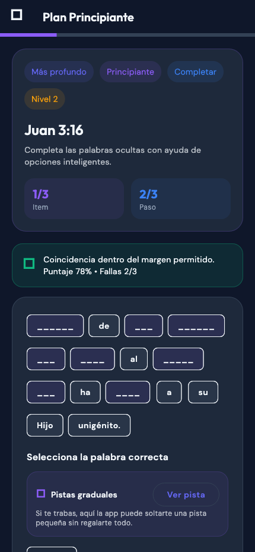

# Practice Flow UI Review — 2026-04-14

## Summary

Implemented and visually verified the new memorization flow in the Flutter frontend with:
- guided exercise sessions by difficulty
- exam levels with masking and tolerance rules
- local plan creation per deck
- setup and session screens connected from deck detail
- visual states for progress, evaluation feedback, and masked-word completion

## Screenshots

### Practice setup

### Practice session

## Design Decisions

- Kept the existing `Outfit + DM Sans` system and the repo's indigo-led palette to avoid visual drift.
- Added a more ritual learning tone through progress chips, segmented metrics, guided step cards, and softer layered surfaces.
- Split the experience into two clear screens: setup first, then focused execution.
- Preserved the classic SRS review flow and layered the new exercise engine beside it instead of replacing it.

## Notes

- `flutter analyze` passes cleanly.
- `flutter test --update-goldens test/ui_capture_test.dart` passes and generated the current screenshots.
- Final visual verification was completed with Flutter golden/widget rendering because the web runtime in this environment still hits a `sqlite3.wasm` initialization issue before the app paints reliably in browser automation.
