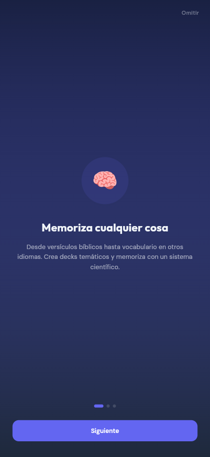
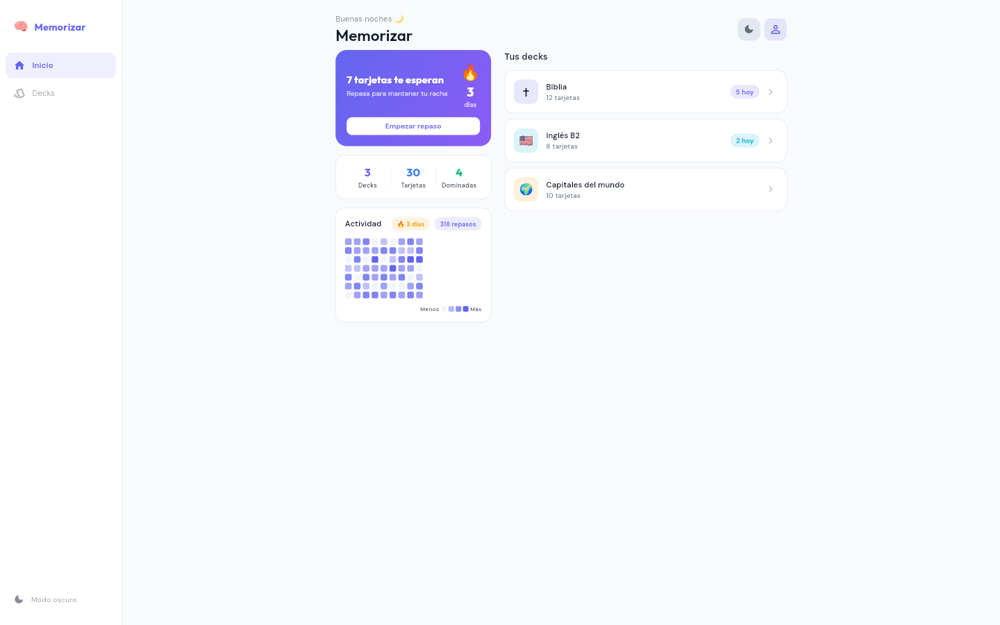
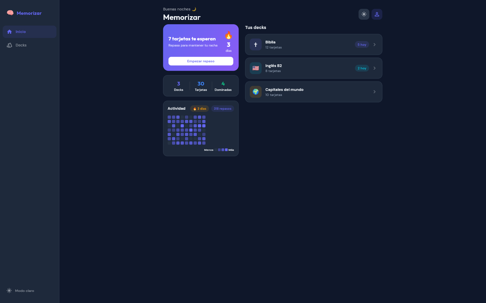
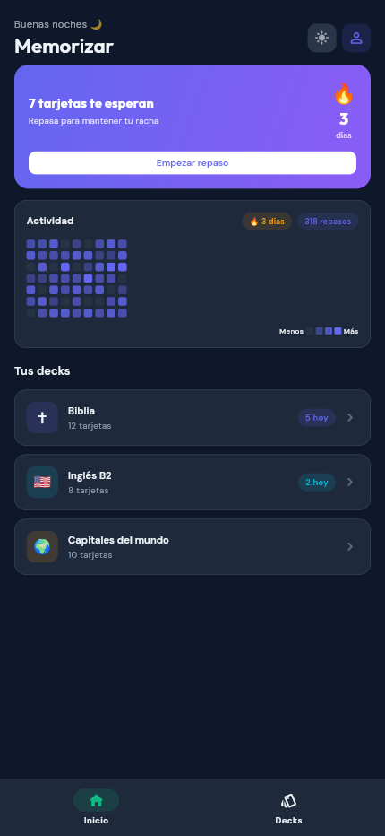
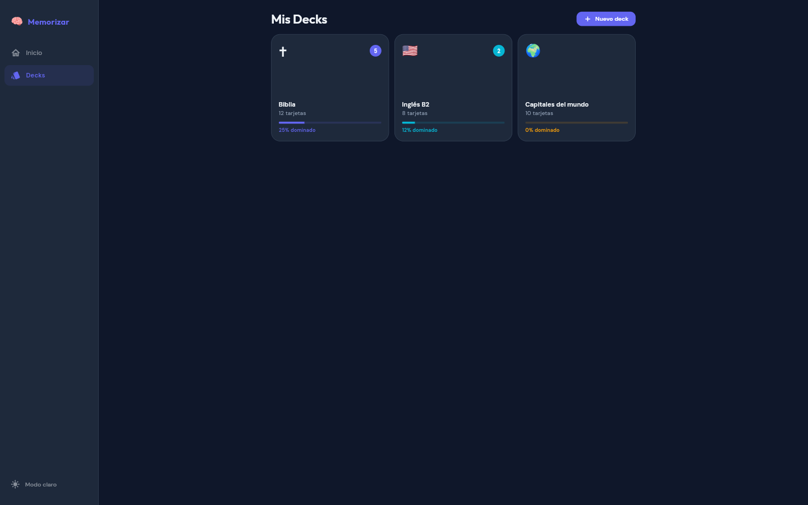
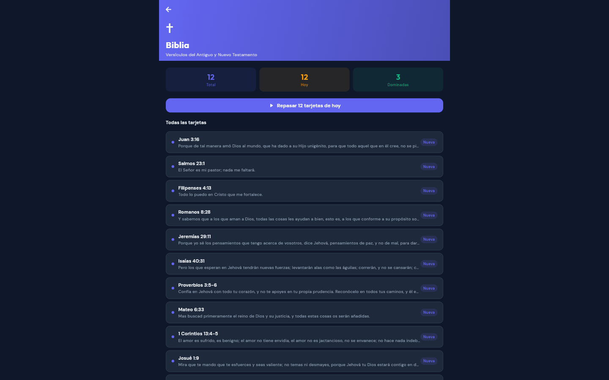
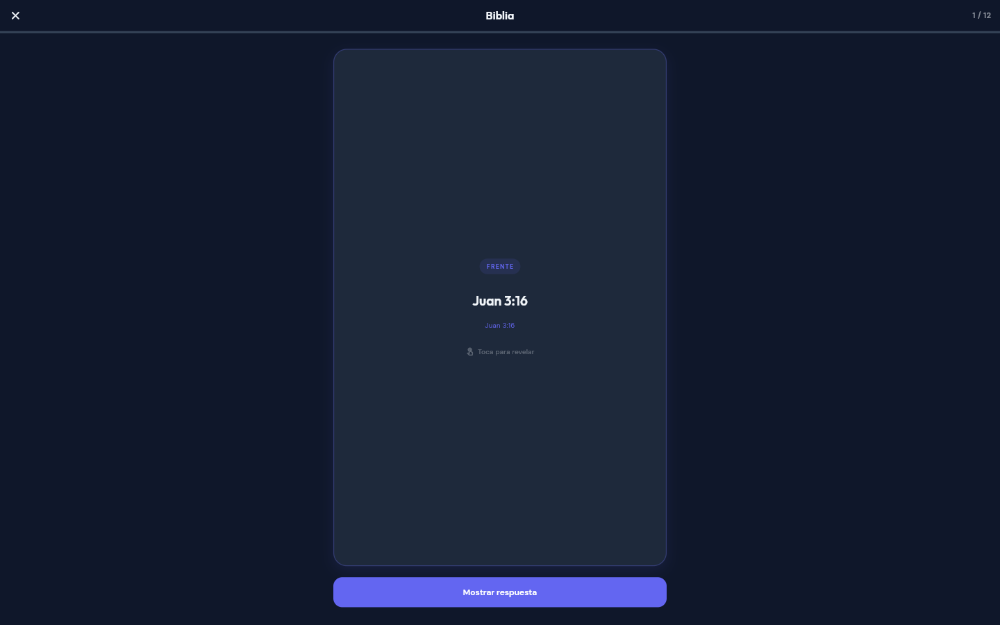
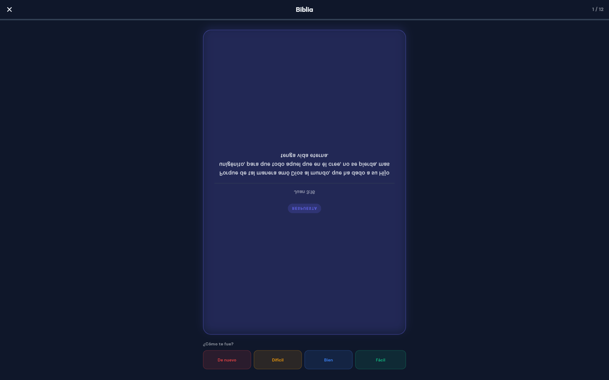

# Memorizar — UI Review (Phases 1–4) — 2026-04-13

## Summary

Completed Phases 1–4 of Memorizar frontend:
- **Phase 1**: Responsive web/desktop layout — sidebar rail (desktop) + bottom nav (mobile), ContentWidth max-width containers
- **Phase 2**: Review animations — flip card (Matrix4.rotateX), slide entrance, ScaleTransition on rating buttons, floating particle celebration screen
- **Phase 3**: Dark/light theme with SharedPreferences persistence, 3-page onboarding flow
- **Phase 4**: Activity heatmap (9×7 GitHub-style grid), real streak from mock data, stats row

## Screenshots

### Onboarding — Page 1 (mobile 430×932, dark)

### Home — Desktop (1440×900, light)

### Home — Desktop (1440×900, dark)

### Home — Mobile (430×932, dark) — bottom nav visible

### Decks — Desktop (1440×900, dark)

### Deck Detail — Biblia (1440×900, dark)

### Review — Card Front (desktop, dark)

### Review — Card Revealed with Rating Buttons (desktop, dark)

## Design Decisions

- **Color palette**: Indigo (#6366F1) as primary, accent colors per deck (purple, blue, orange, etc.)
- **Typography**: Outfit for headings/display, DM Sans for body/UI text
- **Layout**: Sidebar (220px expanded / 72px collapsed) for ≥600px, bottom NavigationBar for mobile
- **Dark mode**: Deep navy (#0F172A) base, slightly lighter card surface (#1E293B)
- **Streak banner**: Indigo→violet gradient, prominent 🔥 counter
- **Activity heatmap**: 9 weeks × 7 days, indigo intensity scale, legend row

## Notes

- Onboarding skips via "Omitir" and marks `memorizar_onboarding_done` in SharedPreferences
- Review session uses SM-2 algorithm (easeFactor, interval, repetitions)
- Phase 5 (Drift offline persistence) is deferred — all data is currently in-memory mock
- App runs on `flutter run -d web-server --release --web-port=8080`
